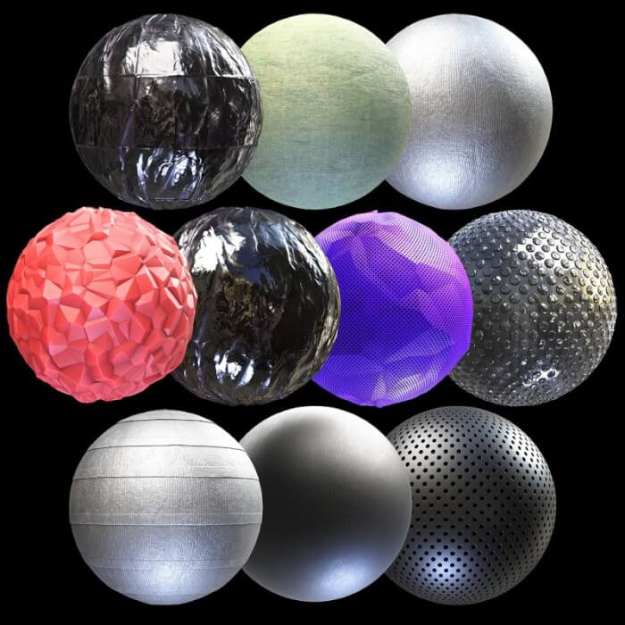
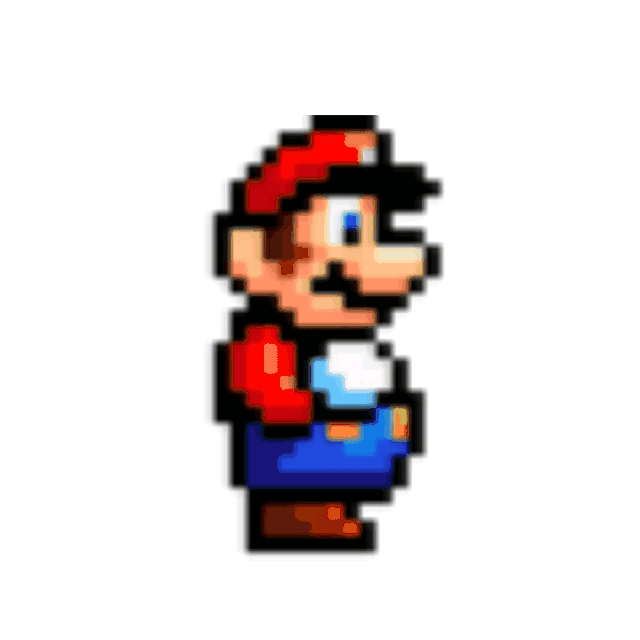
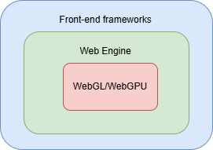

---
# You can also start simply with 'default'
theme: seriph
# random image from a curated Unsplash collection by Anthony
# like them? see https://unsplash.com/collections/94734566/slidev
background: './assets/tres-bg.png'
# some information about your slides (markdown enabled)
title: 3D on the web
info: |
  ## Slidev Starter Template
  Presentation slides for developers.

  Learn more at [Sli.dev](https://sli.dev)
# apply unocss classes to the current slide
class: text-center
# https://sli.dev/features/drawing
drawings:
  persist: false
# slide transition: https://sli.dev/guide/animations.html#slide-transitions
transition: fade-out
# enable MDC Syntax: https://sli.dev/features/mdc
mdc: true
---

# 3D on the Web!

Create awesome realtime 3D experiences with Javascript 💚

<div class="pt-12">
  <span @click="$slidev.nav.next" class="px-2 py-1 rounded cursor-pointer" hover="bg-white bg-opacity-10">
    Start <carbon:arrow-right class="inline"/>
  </span>
</div>

<!--
SLOW DOWN
-->

---
transition: fade-out
---

# Why 3D on the web

Do we really need it?

<p v-click>But you might want it </p>

<ul>
<li v-click>Almost all websites are similar</li>
<li v-click>Unleash your creativity</li>
<li v-click>Effects impossible with simple JS or CSS</li>
<li v-click>Clients more engaged... More profit</li>
<li v-click>Real-time</li>
</ul>

<!--
SLOW DOWN
-->

---
transition: fade-out
---

# I'm talking about this

- https://www.igloo.inc/

- https://cornrevolution.resn.global/

- https://activetheory.net/


---
transition: fade-out
level: 2
---

# Fundamentals of 3D

Every 3D experience needs...

<ol>
<li v-click>🌐 Scene</li>
<li v-click>🎥 Camera</li>
<li v-click>🔩 Renderer</li>
<li v-click>🎳 An object</li>
<li v-click>🎬 RenderLoop (optional)</li>
</ol>
<br>
<p v-click>BTW this is multi-platform!</p>

<!--
SLIDE 4:
- SCENE: Act as a container, allows us to do global operations like search, override, etc. You need at least one
- CAMERA: Allow us to see our 3D world (scene), `Perspective` `Orthographic` are the most used. Experience in photography helps
- RENDERER: Graphic engine, GPU bridge, draw our 3D world
-->

---
transition: fade-out
layout: two-cols
---

# Mesh

<div v-click class="px-2">
<h2>Geometry</h2>

</div>

::right::
<div class="mt-16 px-2" v-click>
<h2>Materials</h2>

</div>

<!--
- There are others way to create 3D object, but the triangular mesh is the most use.
- GPU are REALLY good handling triangles.
- MATERIALS: some react to the light
-->

---
transition: fade-out
layout: two-cols
---

# RenderLoop

<p>Browsers have `RequestAnimationAPI`</p>
<p>FPS frame per second</p>

```js
function animate() {
  // Your animation goes here
  requestAnimationFrame(animate);
  renderer.render(scene, camera);
}
animate();
```

::right::



<!--
- What's the different between a film and a game?
-->

---
transition: fade-out
layout: two-cols
---

# Framework agnostic

### Engines:
- Three.js
- Babylon.js
- PlayCanvas
- OGL

<br />

### Front-end framework:
- Tres.js
- React Three Fiber
- Angular Three
- Threlte

::right::


<!--
If you're in this front-end framework war, let me tell you this talk is not for you.
-->

---
transition: fade-out
---

# Talk is easy show me the code!

http://play.tresjs.org/

<!--
Let's try to put a model!
-->

---
transition: fade-out
---

# One last thing to mention!
Different to other platforms, there are a huge variety of possibilities with building 3D web experiences!

<ul>
<li v-click>E-commerce</li>
<li v-click>Product configurators</li>
<li v-click>Amazing portfolios</li>
<li v-click>XR/VR experiences</li>
<li v-click>Virtual maps / architecture</li>
<li v-click>3D web apps like CAD or data visualization</li>
<li v-click>Image processing</li>
<li v-click>Much more...</li>
</ul>

<!--
Thank
-->

---
transition: fade-out
---
# Thanks

##  My name is Jaime Torrealba
Feel free to ask me about... Vue.js, Three.js, Interactive graphic design 😊, motion design, 3D in general

- Venezuelan living in Yorkshire
- Working at Push Security
- 🍼 New dad
- 🤓 +7 years experiences in web development
- 💚 Vue and ThreeJs lover
- 💚 Ex Tres.js maintainer

### Contact
- <carbon-logo-github /> https://github.com/JaimeTorrealba
- <carbon-logo-twitter /> https://twitter.com/jaimebboyjt
- <carbon-logo-linkedin /> https://www.linkedin.com/in/jaime-torrealba-cordova/
- Bluesky:  https://bsky.app/profile/jaimebboyjt.bsky.social

<!--
SLIDE 10
-->
---